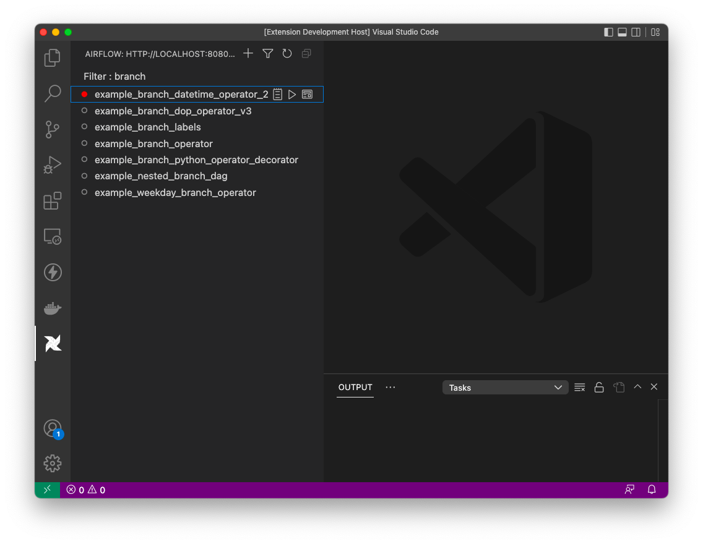

# Airflow Extension for Visual Studio Code

## Introduction

This is a VSCode extension for Apache Airflow 2.0 and up.
You can trigger your DAGs, pause/unpause DAGs, view execution logs, explore source code and do much more.
The motivation of this extension is having the same functionality like Airflow Web UI and make Airflow development easier for vscode developers.

## Requirements - Airflow REST Api

To be able to connect an Airflow Server, you should enable Airflow Rest Api.
You can take a look the link below on how to do it.

https://airflow.apache.org/docs/apache-airflow/stable/security/api.html

## Bug Report

If you have an issue or new feature request, please click link below to add a new issue.

https://github.com/necatiarslan/airflow-vscode-extension/issues/new

Please start issue with "fix:" and new feature with "feat:" in the title.

## Install Airflow In Your Local
If you want to test Airflow on your machine in a docker container, click link below on how to run Airflow in your local machine in 5 mins.

https://www.youtube.com/watch?v=aTaytcxy2Ck

## Todo List
I am working on these features now, so they will be available in a couple of weeks.

- Multiple server support
- Dag Details View
		1. Trigger Dag
		2. Dag Execution Logs
		3. Execution Status
		4. Execution History
- Server Health Check/Status
- Logging
- Execution History / Report / Analysis
- Favorites
- Dag Coloring/Tagging
- Support All Authentication Methods
- Code Snipets
- Dag Code Checks
- Dag Execution Status Indigator on dag list

Thanks,
Necati ARSLAN
necatia@gmail.com