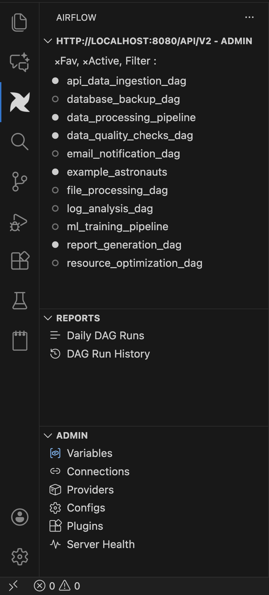
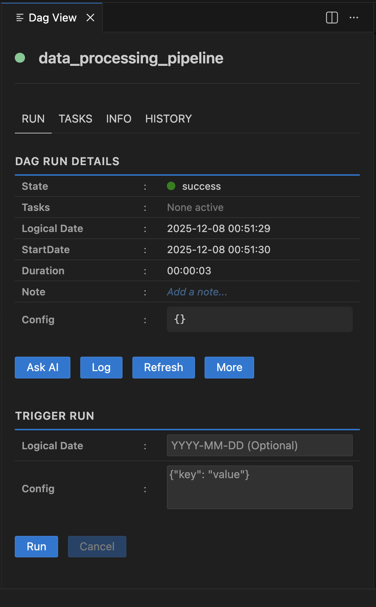
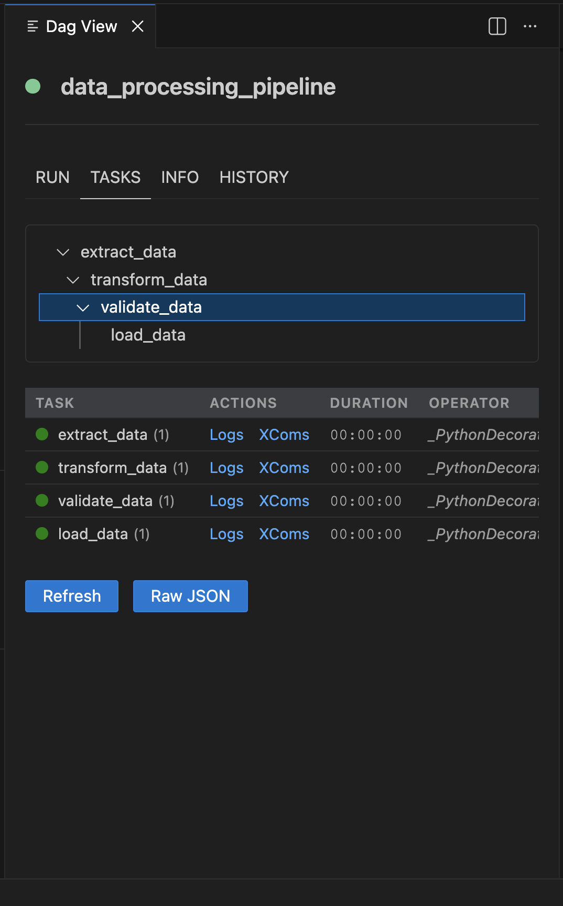
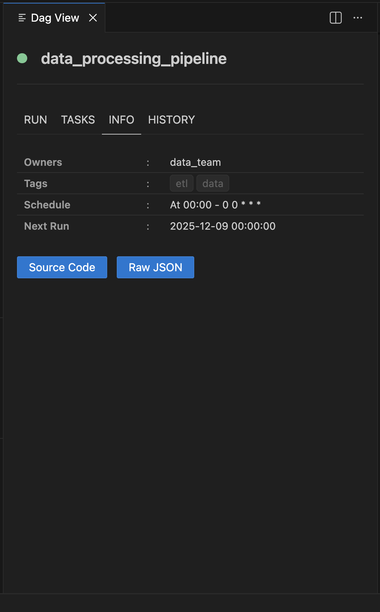
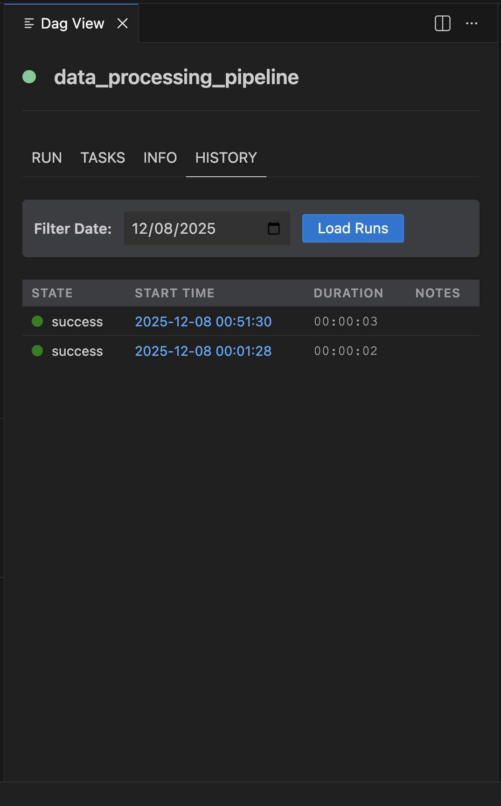
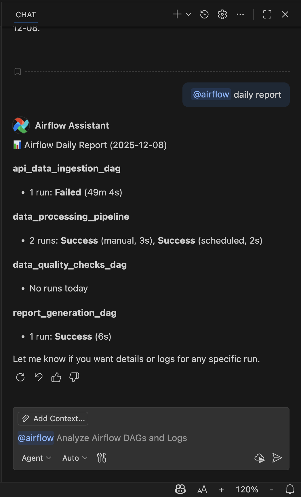
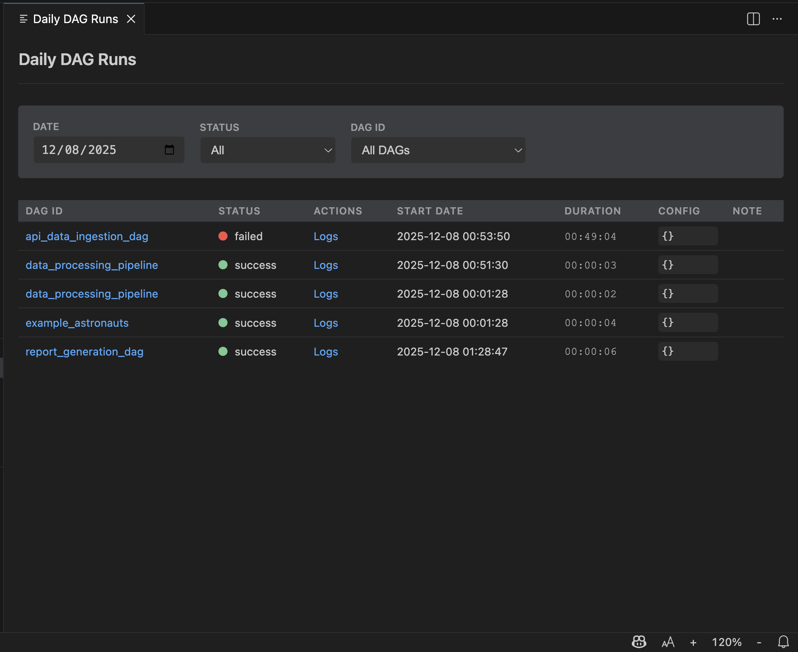
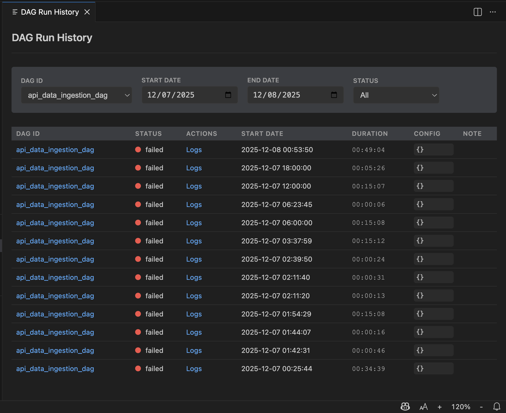

# Airflow Extension for Visual Studio Code
✅ Now works with Airflow 3.0


## 🤖 Chat with Airflow


A Visual Studio Code extension to interact with [Apache Airflow](https://airflow.apache.org/) (v2.x & v3.x) directly from your editor.  
Trigger DAGs, pause/unpause, explore DAG runs, view logs, browse code, and more—no browser required.

## 🔑 Features

- **DAG List**  
  - Browse all available DAGs in a tree view.
  - Filter DAGs by name, owner, active/paused status, tags
  - Add your favorite DAGs to favorites to quickly access them
  - Add multiple Airflow Servers and switch between them

- **DAG Actions**  
  - Trigger a DAG with optional config and date
  - Pause, or unpause any DAG with a single click
  - View source code running on Airflow

- **DAG Run Explorer**  
  - View past & current DAG runs  
  - View logs  
  - See task instances, execution durations, and statuses

- **DAG Runs View**
  - Browse all DAG runs across all DAGs for a specific date
  - Filter by status (success, failed, running, queued) and specific DAG ID
  - See execution details: start date, duration, config, and notes
  - Click on any DAG run to open detailed DagView for analysis

- **New Design & Experience**
  - **Modern UI**: Completely refreshed design for Admin and Report views with consistent theming
  - **Smart Log View**: Enhanced log viewer integrated with AI for instant analysis
  - **Smart Controls**: Context-aware Trigger/Cancel buttons that appear based on DAG state
  - **Navigation**: Jump to any view using `@airflow` commands

- **AI Airflow Assistant**  
  - Get AI-powered assistance for analyzing DAG logs and troubleshooting issues
  - Click "Ask AI" in the DagView to open the AI chat interface
  - In the Chat, use `@airflow` to ask questions and execute commands like triggering DAGs, pausing/unpausing, checking failed runs, and more
  - AI analyzes DAG code and logs to provide insights and recommendations
  - Integrated with VS Code's native chat interface for seamless interaction
  - 24 language model tools for intelligent DAG control and monitoring: trigger runs, pause/unpause DAGs, check failed runs, analyze latest DAG execution, view run history, stop running DAGs, get source code, navigation, and more
  - Use `@airflow` in the chat to access all AI-powered tools
  - Airflow Skills are available as a bundled set to help the assistant respond with consistent, task-focused guidance. Installing them improves accuracy and keeps responses aligned with Airflow best practices and this extension's workflows. You will see a prompt to install skills when you ask an AI question if you haven't installed them yet.

- **MCP Server (Model Context Protocol)**  
  - Expose all Airflow tools to any external MCP-compatible AI client (Cursor, Windsurf, Antigravity, Claude Desktop, Continue, etc.)
  - Built-in MCP bridge server runs on `127.0.0.1:37115` by default
  - Start, stop, and manage the MCP server directly from the sidebar
  - Configure host, port, session capacity, and enabled tools via the MCP Manager view
  - Generates a ready-to-paste JSON config snippet for connecting external clients

## 🤖 AI Airflow Assistant Tools & Sample Prompts

The extension provides 24 language model tools that integrate with VS Code's AI chat. Use `@airflow` in the chat to access these tools.

### Control Tools

#### Trigger DAG Run
- **Purpose**: Execute a DAG with optional configuration
- **Sample Prompts**:
  - `@airflow trigger data_pipeline_dag`
  - `@airflow trigger etl_job_dag with config {"max_workers": 10}`
  - `@airflow run my_dag on 2025-12-03`

#### Pause DAG
- **Purpose**: Stop new DAG runs from being scheduled
- **Sample Prompts**:
  - `@airflow pause data_pipeline_dag`
  - `@airflow disable staging_etl_dag`
  - `@airflow pause all failing dags`

#### Unpause DAG
- **Purpose**: Enable scheduling for a paused DAG
- **Sample Prompts**:
  - `@airflow unpause data_pipeline_dag`
  - `@airflow activate my_dag`
  - `@airflow resume production_job`

#### Stop DAG Run
- **Purpose**: Terminate a currently running DAG execution
- **Sample Prompts**:
  - `@airflow stop data_pipeline_dag run`
  - `@airflow cancel current run of my_dag`
  - `@airflow kill the running data_ingestion_dag`

### Monitoring Tools

#### Get DAG Runs
- **Purpose**: View execution history for a specific DAG with optional date filter
- **Sample Prompts**:
  - `@airflow get dag runs for api_data_ingestion_dag`
  - `@airflow show runs of data_pipeline_dag on 2025-12-03`
  - `@airflow list runs for etl_job_dag from last week`

#### Get DAG History
- **Purpose**: View DAG run history on a specific date with status, duration, and notes
- **Sample Prompts**:
  - `@airflow get dag history of api_data_ingestion_dag`
  - `@airflow show history for data_pipeline_dag on 2025-12-02`
  - `@airflow view past runs of my_dag today`

#### Get Failed Runs
- **Purpose**: Identify and analyze failed DAG runs across the system
- **Sample Prompts**:
  - `@airflow get failed runs`
  - `@airflow show failed dags from last 24 hours`
  - `@airflow which dags failed in the last 48 hours`

#### List Active DAGs
- **Purpose**: View all currently enabled DAGs
- **Sample Prompts**:
  - `@airflow list active dags`
  - `@airflow show all running dags`
  - `@airflow get enabled dags`

#### List Paused DAGs
- **Purpose**: View all currently disabled DAGs
- **Sample Prompts**:
  - `@airflow list paused dags`
  - `@airflow show disabled dags`
  - `@airflow get all paused dags`

#### Get Running DAGs
- **Purpose**: List all DAGs that currently have running or queued tasks
- **Sample Prompts**:
  - `@airflow get running dags`
  - `@airflow get active runs`
  - `@airflow what is running now?`

### Analysis Tools

#### Analyse DAG Latest Run
- **Purpose**: Comprehensive diagnostic report of the latest DAG execution including tasks, logs, and source code
- **Sample Prompts**:
  - `@airflow analyze api_data_ingestion_dag`
  - `@airflow get full diagnostics for data_pipeline_dag`
  - `@airflow show latest execution details and logs for etl_job_dag`
  - `@airflow what went wrong with my_dag last run`

#### Get DAG Run Detail
- **Purpose**: Deep dive analysis of a specific DAG run ID
- **Sample Prompts**:
  - `@airflow analyze run <run_id> of <dag_id>`
  - `@airflow get run details for dag_id=my_dag run_id=manual__2023...`

#### Get DAG Source Code
- **Purpose**: Retrieve and view the Python source code of a DAG
- **Sample Prompts**:
  - `@airflow review source code for data_pipeline_dag`
  - `@airflow show source code for data_pipeline_dag`
  - `@airflow get code for my_etl_dag`
  - `@airflow let me see the implementation of api_ingestion_dag`

#### AI Chat Analysis
- **Purpose**: Get AI-powered insights and recommendations using all available tools
- **Sample Prompts**:
  - `@airflow why is data_pipeline_dag failing? Analyze and show me the logs`
  - `@airflow give me a summary of failed runs and recommend fixes`
  - `@airflow check if my dags are healthy and pause any that keep failing`

### Navigation Tools

#### Open Views
- **Purpose**: Quickly navigate to any part of the extension using natural language
- **Sample Prompts**:
  - `@airflow open log view for my_dag`
  - `@airflow show me variables`
  - `@airflow go to connections`
  - `@airflow open provider list`
  - `@airflow show server health`

## � MCP Server (Model Context Protocol)

The extension includes a built-in **MCP bridge server** that exposes all Airflow tools to any external AI agent or client that supports the [Model Context Protocol](https://modelcontextprotocol.io/) (e.g., Cursor, Windsurf, Antigravity, Claude Desktop, Continue, and other MCP-compatible tools).

### How It Works

1. The MCP bridge listens on `127.0.0.1:37115` (configurable).
2. An external MCP client connects and discovers all available Airflow tools.
3. The client can call any tool (trigger DAG, get logs, analyze runs, etc.) just as `@airflow` does in VS Code Chat.

### Getting Started with MCP

1. Open the **Airflow** sidebar and expand the **MCP** section.
2. Click **Start** to launch the bridge server.
3. Click **Manage** to open the MCP Manager and copy the generated config snippet.
4. Paste the config snippet into your MCP client's configuration file.

### MCP Manager

Open the MCP Manager via the sidebar (**MCP → Manage**) to:
- View the current server **host** and **port**.
- Copy the ready-to-paste **JSON config** for your MCP client.
- Start or stop the bridge server.

### Example Config (Cursor / Windsurf / Antigravity / Claude Desktop)

```json
{
  "mcpServers": {
    "airflow": {
      "command": "node",
      "args": ["/path/to/extension/out/mcp/cli.js"],
      "env": {
        "AIRFLOW_MCP_HOST": "127.0.0.1",
        "AIRFLOW_MCP_PORT": "37115"
      }
    }
  }
}
```

> **Tip**: The MCP Manager generates the exact `args` path for your machine — just copy and paste it.

### MCP Sidebar Actions

| Action | Description |
| ------ | ----------- |
| **Status** | Show current server state (running / stopped) and active session count |
| **Start** | Start the MCP bridge server |
| **Stop** | Stop all active MCP sessions and the bridge server |
| **Manage** | Open the MCP Manager view with config snippet and settings |

## �📷 Screenshots

| Dag Tree | Runs | Tasks |
| ----------- | ----------- | ----------- |
|  |  |  |


| Info | Run History | AI |
| ----------- | ----------- | ----------- |
|  |  |  |

| Daily Dag Runs | Dag Run History |
| ----------- | ----------- |
|  |  |
## ⚙️ Configuration
After installing the extension, you need to configure the extension to connect to your Airflow Server.
- Click 🔌 Connect to Airflow Server at the top of the extension sidebar.
- Enter your Airflow Server API Url
    - Exp Airflow 2: http://localhost:8080/api/v1
    - Exp Airflow 3: http://localhost:8080/api/v2
- Enter your Airflow username
- Enter your Airflow password
  - Passwords are stored using VS Code Secret Storage (OS credential/keychain-backed when available).

You can also add multiple Airflow Servers to connect to.
- Use [+] button to add a new Airflow Server
- Use [-] button to remove an Airflow Server
- Use [🔌] to switch between servers


ℹ️ To be able to connect an Airflow Server, you should enable Airflow Rest Api.
You can take a look the link below on how to do it.

https://airflow.apache.org/docs/apache-airflow/stable/security/api.html


## 🪲 Bug & New Feature Report

If you have an issue or new feature request, please click link below to add a new issue.

https://github.com/necatiarslan/airflow-vscode-extension/issues/new

## 💻 Local Airflow via Astronomer
Use Astro provided by the team who build Airflow 
https://docs.astronomer.io/astro/cli/overview

To spin up a local Airflow instance for testing:

```bash 
brew install astro  #install cli tool from homebrew
astro dev init      #init the local env
astro dev start     #start airflow as a docker container

#Then you can connect your local airflow using the extension.
#airflow 2 url        http://localhost:8080/api/v1
#airflow 3 url        http://localhost:8080/api/v2
#user/pass  admin/admin
```

## 📊 Telemetry & Privacy

This extension collects **anonymous usage telemetry** to help improve reliability and features.

### Telemetry control
Telemetry is collected **only if VS Code telemetry is enabled**.
You can disable telemetry via: Settings → Telemetry → Telemetry Level  

## 📝 Roadmap

### Coming Soon
- Task View
    - Instance Details
    - Rendered Template
- Test Connection language model tool
- Add trigger config files

## 💖 Sponsor & Feedback

If you find this extension useful, please consider:
- ⭐️ Starring the repo
- 🪲 Reporting bugs or suggesting features on [GitHub Issues](https://github.com/necatiarslan/airflow-vscode-extension/issues/new)
- 💖 [Sponsoring me on GitHub](https://github.com/sponsors/necatiarslan)
- ✍️ Taking our quick user [survey](https://docs.google.com/forms/d/e/1FAIpQLSevcgFSUgc0anMMbZUp5CXNot2zyQDIiN6bkzc0lbWugolVkg/viewform)

## 📬 Stay in Touch

- Author: Necati ARSLAN (necatia@gmail.com)
- LinkedIn: https://www.linkedin.com/in/necati-arslan/
- Marketplace: https://marketplace.visualstudio.com/items?itemName=NecatiARSLAN.airflow-vscode-extension

Enjoy! 🚀
