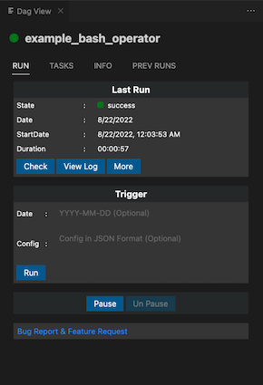

# Airflow Extension for Visual Studio Code
✅ Now works with Airflow 3.0


A Visual Studio Code extension to interact with [Apache Airflow](https://airflow.apache.org/) (v2.x & v3.x) directly from your editor.  
Trigger DAGs, pause/unpause, explore DAG runs, view logs, browse code, and more—no browser required.

## 🔑 Features

- **DAG List**  
  - Browse all available DAGs in a tree view.
  - Filter DAGs by name, owner, active/paused status, tags
  - Add your favorite DAGs to favorites to quickly access them
  - Add multiple Airflow Servers and switch between them

- **DAG Actions**  
  - Trigger a DAG with optional config and date
  - Pause, or unpause any DAG with a single click
  - View source code running on Airflow

- **DAG Run Explorer**  
  - View past & current DAG runs  
  - View logs  
  - See task instances, execution durations, and statuses

- **DAG Runs View**
  - Browse all DAG runs across all DAGs for a specific date
  - Filter by status (success, failed, running, queued) and specific DAG ID
  - See execution details: start date, duration, config, and notes
  - Click on any DAG run to open detailed DagView for analysis

- **New Design & Experience**
  - **Modern UI**: Completely refreshed design for Admin and Report views with consistent theming
  - **Smart Log View**: Enhanced log viewer integrated with AI for instant analysis
  - **Smart Controls**: Context-aware Trigger/Cancel buttons that appear based on DAG state
  - **Navigation**: Jump to any view using `@airflow` commands

- **AI Airflow Assistant**  
  - Get AI-powered assistance for analyzing DAG logs and troubleshooting issues
  - Click "Ask AI" in the DagView to open the AI chat interface
  - In the Chat, use `@airflow` to ask questions and execute commands like triggering DAGs, pausing/unpausing, checking failed runs, and more
  - AI analyzes DAG code and logs to provide insights and recommendations
  - Integrated with VS Code's native chat interface for seamless interaction
  - 21 language model tools for intelligent DAG control and monitoring: trigger runs, pause/unpause DAGs, check failed runs, analyze latest DAG execution, view run history, stop running DAGs, navigation, and more
  - Use `@airflow` in the chat to access all AI-powered tools

## 🤖 AI Airflow Assistant Tools & Sample Prompts

The extension provides 21 language model tools that integrate with VS Code's AI chat. Use `@airflow` in the chat to access these tools.

### Control Tools

#### Trigger DAG Run
- **Purpose**: Execute a DAG with optional configuration
- **Sample Prompts**:
  - `@airflow trigger data_pipeline_dag`
  - `@airflow trigger etl_job_dag with config {"max_workers": 10}`
  - `@airflow run my_dag on 2025-12-03`

#### Pause DAG
- **Purpose**: Stop new DAG runs from being scheduled
- **Sample Prompts**:
  - `@airflow pause data_pipeline_dag`
  - `@airflow disable staging_etl_dag`
  - `@airflow pause all failing dags`

#### Unpause DAG
- **Purpose**: Enable scheduling for a paused DAG
- **Sample Prompts**:
  - `@airflow unpause data_pipeline_dag`
  - `@airflow activate my_dag`
  - `@airflow resume production_job`

#### Stop DAG Run
- **Purpose**: Terminate a currently running DAG execution
- **Sample Prompts**:
  - `@airflow stop data_pipeline_dag run`
  - `@airflow cancel current run of my_dag`
  - `@airflow kill the running data_ingestion_dag`

### Monitoring Tools

#### Get DAG Runs
- **Purpose**: View execution history for a specific DAG with optional date filter
- **Sample Prompts**:
  - `@airflow get dag runs for api_data_ingestion_dag`
  - `@airflow show runs of data_pipeline_dag on 2025-12-03`
  - `@airflow list runs for etl_job_dag from last week`

#### Get DAG History
- **Purpose**: View DAG run history on a specific date with status, duration, and notes
- **Sample Prompts**:
  - `@airflow get dag history of api_data_ingestion_dag`
  - `@airflow show history for data_pipeline_dag on 2025-12-02`
  - `@airflow view past runs of my_dag today`

#### Get Failed Runs
- **Purpose**: Identify and analyze failed DAG runs across the system
- **Sample Prompts**:
  - `@airflow get failed runs`
  - `@airflow show failed dags from last 24 hours`
  - `@airflow which dags failed in the last 48 hours`

#### List Active DAGs
- **Purpose**: View all currently enabled DAGs
- **Sample Prompts**:
  - `@airflow list active dags`
  - `@airflow show all running dags`
  - `@airflow get enabled dags`

#### List Paused DAGs
- **Purpose**: View all currently disabled DAGs
- **Sample Prompts**:
  - `@airflow list paused dags`
  - `@airflow show disabled dags`
  - `@airflow get all paused dags`

#### Get Running DAGs
- **Purpose**: List all DAGs that currently have running or queued tasks
- **Sample Prompts**:
  - `@airflow get running dags`
  - `@airflow get active runs`
  - `@airflow what is running now?`

### Analysis Tools

#### Analyse DAG Latest Run
- **Purpose**: Comprehensive diagnostic report of the latest DAG execution including tasks, logs, and source code
- **Sample Prompts**:
  - `@airflow analyze api_data_ingestion_dag`
  - `@airflow get full diagnostics for data_pipeline_dag`
  - `@airflow show latest execution details and logs for etl_job_dag`
  - `@airflow what went wrong with my_dag last run`

#### Get DAG Run Detail
- **Purpose**: Deep dive analysis of a specific DAG run ID
- **Sample Prompts**:
  - `@airflow analyze run <run_id> of <dag_id>`
  - `@airflow get run details for dag_id=my_dag run_id=manual__2023...`

#### AI Chat Analysis
- **Purpose**: Get AI-powered insights and recommendations using all available tools
- **Sample Prompts**:
  - `@airflow why is data_pipeline_dag failing? Analyze and show me the logs`
  - `@airflow give me a summary of failed runs and recommend fixes`
  - `@airflow check if my dags are healthy and pause any that keep failing`

### Navigation Tools

#### Open Views
- **Purpose**: Quickly navigate to any part of the extension using natural language
- **Sample Prompts**:
  - `@airflow open log view for my_dag`
  - `@airflow show me variables`
  - `@airflow go to connections`
  - `@airflow open provider list`
  - `@airflow show server health`

## 📷 Screenshots

| Dag Tree | Runs | Tasks |
| ----------- | ----------- | ----------- |
|  |  |  |


| Info | Run History | AI |
| ----------- | ----------- | ----------- |
|  |  |  |

| Daily Dag Runs | Dag Run History |
| ----------- | ----------- |
|  |  |

## ⚙️ Configuration
After installing the extension, you need to configure the extension to connect to your Airflow Server.
- Click 🔌 Connect to Airflow Server at the top of the extension sidebar.
- Enter your Airflow Server API Url
    - Exp Airflow 2: http://localhost:8080/api/v1
    - Exp Airflow 3: http://localhost:8080/api/v2
- Enter your Airflow username
- Enter your Airflow password

You can also add multiple Airflow Servers to connect to.
- Use [+] button to add a new Airflow Server
- Use [-] button to remove an Airflow Server
- Use [🔌] to switch between servers


ℹ️ To be able to connect an Airflow Server, you should enable Airflow Rest Api.
You can take a look the link below on how to do it.

https://airflow.apache.org/docs/apache-airflow/stable/security/api.html


## 🪲 Bug & New Feature Report

If you have an issue or new feature request, please click link below to add a new issue.

https://github.com/necatiarslan/airflow-vscode-extension/issues/new

## 💻 Local Airflow via Astronomer
Use Astro provided by the team who build Airflow 
https://docs.astronomer.io/astro/cli/overview

To spin up a local Airflow instance for testing:

```bash 
brew install astro  #install cli tool from homebrew
astro dev init      #init the local env
astro dev start     #start airflow as a docker container

#Then you can connect your local airflow using the extension.
#airflow 2 url        http://localhost:8080/api/v1
#airflow 3 url        http://localhost:8080/api/v2
#user/pass  admin/admin
```

## 📝 Roadmap

### Coming Soon
- Task View
    - Instance Details
    - Rendered Template


## 💖 Sponsor & Feedback

If you find this extension useful, please consider:
- ⭐️ Starring the repo
- 🪲 Reporting bugs or suggesting features on [GitHub Issues](https://github.com/necatiarslan/airflow-vscode-extension/issues/new)
- 💖 [Sponsoring me on GitHub](https://github.com/sponsors/necatiarslan)
- ✍️ Taking our quick user [survey](https://docs.google.com/forms/d/e/1FAIpQLSevcgFSUgc0anMMbZUp5CXNot2zyQDIiN6bkzc0lbWugolVkg/viewform)

## 📬 Stay in Touch

- Author: Necati ARSLAN (necatia@gmail.com)
- LinkedIn: https://www.linkedin.com/in/necati-arslan/
- Marketplace: https://marketplace.visualstudio.com/items?itemName=NecatiARSLAN.airflow-vscode-extension

Enjoy! 🚀

