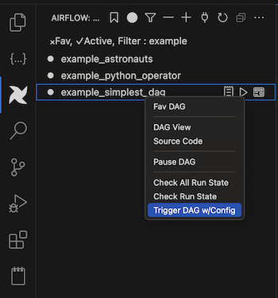

# Airflow Extension for Visual Studio Code


## Introduction

This is a VSCode extension for Apache Airflow 2.0 and up.
You can trigger your DAGs, pause/unpause DAGs, view execution logs, explore source code and do much more.
The motivation of this extension is having the same functionality like Airflow Web UI and make Airflow development easier for vscode developers.

To install the vscode extension, search 'Airflow' in the marketplace and install owned by Necati ARSLAN.

## Requirements - Airflow REST Api

To be able to connect an Airflow Server, you should enable Airflow Rest Api.
You can take a look the link below on how to do it.

https://airflow.apache.org/docs/apache-airflow/stable/security/api.html

## Survey
Please take this survey to help me make the extension better.\
https://bit.ly/airflow-extension-survey

## Bug Report

If you have an issue or new feature request, please click link below to add a new issue.

https://github.com/necatiarslan/airflow-vscode-extension/issues/new

## To Run Airflow In Your Local
Use Astro provided by the team who build Airflow 
https://docs.astronomer.io/astro/cli/overview

```bash 
brew install astro  #install cli tool from homebrew
astro dev init      #init the local env
astro dev start     #start airflow as a docker container

#then you can connect your local airflow using the extension.
#url        http://localhost:8080/api/v1
#user/pass  admin/admin
```

## Dag Tree


## Dag Run


## Dag Tasks


# Dag Info


## Previous Dag Runs


## Todo List
-

## Nice To Have
- Skip Try=0 Logs
- Run Selected Tasks
- Connections, Variables, XComs
- Hierarchical Tasks List
- Tasks graph view
- Tasks gantt chart view
- Prev Run, Date Filter
- Task View
    - Instance Details
    - Rendered Template
    - Log
    - X-Com
- Fix: not runned task duration
- TreeView Dag List Pagination (top 100 limit now)
- Treeview Dag hierarcy by owner, last run date, next run date, dag file folder structure, tags
- New DAG Wizard
- Run DAGs in your local (devcontainer)
- DAG Dry Run
- DAG Validation
- Run DAG Tests
- DAG Dependencies
- Preview DAG flow in your local
- Hide Dags & Show Hidden Dags Filter
- Add Survey and Bug Report to TreeView Other commands
- DagView Table Colors
- How To Enable Airflow API and Connect
- DAG.test() support
- Highligt DAG and Operator Keywords
- Server Health Check/Status
- Dag Code Checks
- Server Alias

Follow me on linkedin to get latest news \
https://www.linkedin.com/in/necati-arslan/

Thanks, \
Necati ARSLAN \
necatia@gmail.com
