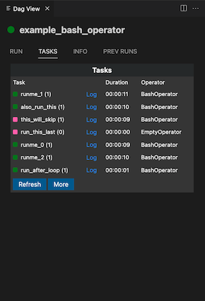

# Airflow Extension for Visual Studio Code
✅ Now works with Airflow 3.0


A Visual Studio Code extension to interact with [Apache Airflow](https://airflow.apache.org/) (v2.x & v3.x) directly from your editor.  
Trigger DAGs, pause/unpause, explore DAG runs, view logs, browse code, and more—no browser required.

## 🔑 Features

- **DAG List**  
  - Browse all available DAGs in a tree view.
  - Filter DAGs by name, owner, active/paused status, tags
  - Add your favorite DAGs to favorites to quickly access them
  - Add multiple Airflow Servers and switch between them

- **DAG Actions**  
  - Trigger a DAG with optional config and date
  - Pause, or unpause any DAG with a single click
  - View source code running on Airflow

- **DAG Run Explorer**  
  - View past & current DAG runs  
  - View logs  
  - See task instances, execution durations, and statuses

## 📷 Screenshots

| Dag Tree | Runs | Tasks |
| ----------- | ----------- | ----------- |
|  |  |  |


| Info | Run History |
| ----------- | ----------- |
|  |  |


## ⚙️ Configuration
After installing the extension, you need to configure the extension to connect to your Airflow Server.
- Click 🔌 Connect to Airflow Server at the top of the extension sidebar.
- Enter your Airflow Server API Url
    - Exp Airflow 2: http://localhost:8080/api/v1
    - Exp Airflow 3: http://localhost:8080/api/v2
- Enter your Airflow username
- Enter your Airflow password

You can also add multiple Airflow Servers to connect to.
- Use [+] button to add a new Airflow Server
- Use [-] button to remove an Airflow Server
- Use [🔌] to switch between servers


ℹ️ To be able to connect an Airflow Server, you should enable Airflow Rest Api.
You can take a look the link below on how to do it.

https://airflow.apache.org/docs/apache-airflow/stable/security/api.html


## 🪲 Bug & New Feature Report

If you have an issue or new feature request, please click link below to add a new issue.

https://github.com/necatiarslan/airflow-vscode-extension/issues/new

## 💻 Local Airflow via Astronomer
Use Astro provided by the team who build Airflow 
https://docs.astronomer.io/astro/cli/overview

To spin up a local Airflow instance for testing:

```bash 
brew install astro  #install cli tool from homebrew
astro dev init      #init the local env
astro dev start     #start airflow as a docker container

#Then you can connect your local airflow using the extension.
#airflow 2 url        http://localhost:8080/api/v1
#airflow 3 url        http://localhost:8080/api/v2
#user/pass  admin/admin
```

## 📝 Roadmap

### Coming Soon
- Run Selected Tasks
- Hide Dags & Show Hidden Dags Filter
- Connections, Variables, XComs
- Hierarchical Tasks List
- Prev Run, Date Filter
- Task View
    - Instance Details
    - Rendered Template
    - Log
    - X-Com
- Fix: not runned task duration
- Treeview Dag hierarcy by owner, last run date, next run date, dag file folder structure, tags
- New DAG Wizard
- DAG Dry Run
- Run DAG Tests
- DAG.test() support
- Highligt DAG and Operator Keywords
- Server Health Check/Status


## 💖 Sponsor & Feedback

If you find this extension useful, please consider:
- ⭐️ Starring the repo
- 🪲 Reporting bugs or suggesting features on [GitHub Issues](https://github.com/necatiarslan/airflow-vscode-extension/issues/new)
- 💖 [Sponsoring me on GitHub](https://github.com/sponsors/necatiarslan)
- ✍️ Taking our quick user [survey](https://docs.google.com/forms/d/e/1FAIpQLSevcgFSUgc0anMMbZUp5CXNot2zyQDIiN6bkzc0lbWugolVkg/viewform)

## 📬 Stay in Touch

- Author: Necati ARSLAN (necatia@gmail.com)
- LinkedIn: https://www.linkedin.com/in/necati-arslan/
- Marketplace: https://marketplace.visualstudio.com/items?itemName=NecatiARSLAN.airflow-vscode-extension

Enjoy! 🚀

