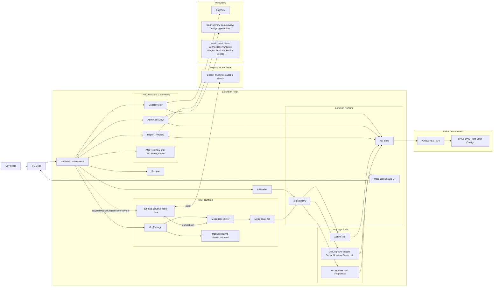

# Airflow VS Code Extension - System Diagram

This diagram shows the runtime architecture of the extension, including VS Code UI components, Airflow API integrations, AI tools, and the MCP bridge/server path.

## Request and Control Flow

1. User actions in tree views and commands call extension handlers.
2. Handlers use API and tool runtime to query or mutate Airflow resources.
3. Results render in tree items, webviews, and output messages.
4. MCP clients connect through stdio to `out/mcp/server.js`.
5. The stdio bridge connects to `McpBridgeServer` over configured host and port.
6. `McpDispatcher` resolves enabled tools from `ToolRegistry` and executes tool commands.

## MCP Capacity Model

- `McpBridgeServer` enforces a session cap from MCP settings.
- Extra MCP socket connections are queued until capacity is available.
- `McpManager` tracks active pseudoterminal sessions and can start/stop all sessions.
