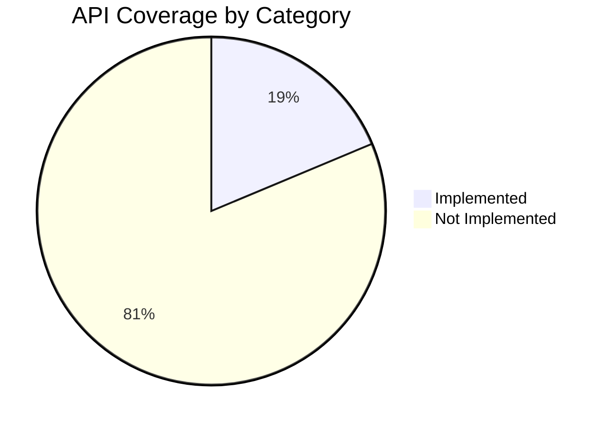

# Airflow REST API v2 — Gap Analysis & Use Case Recommendations

## Current Implementation Summary

[Api.ts](file:///Users/necatiarslan/github/airflow-vscode-extension/src/common/Api.ts) implements **20 methods** covering basic DAG operations:

| Method | API Endpoint | HTTP | Category |
|--------|-------------|------|----------|
| `checkConnection` | `/dags?limit=1` | GET | DAG |
| `getDagList` | `/dags` | GET | DAG |
| `triggerDag` | `/dags/{id}/dagRuns` | POST | DAG Run |
| `getDagRun` | `/dags/{id}/dagRuns/{runId}` | GET | DAG Run |
| `getLastDagRun` | (composite) | — | DAG Run |
| `getDagRunHistory` | `/dags/{id}/dagRuns` | GET | DAG Run |
| `pauseDag` | `/dags/{id}` | PATCH | DAG |
| `getSourceCode` | `/dagSources/{id}` | GET | DAG Source |
| `getImportErrors` | `/importErrors` | GET | Import Error |
| `getTaskInstanceLog` | `.../logs/{try}` | GET | Task Instance |
| `getTaskInstanceLogText` | (composite) | — | Task Instance |
| `getLastDagRunLogText` | (composite) | — | Task Instance |
| `getDagRunLogText` | (composite) | — | Task Instance |
| `getDagInfo` | `/dags/{id}` | GET | DAG |
| `getDagTasks` | `/dags/{id}/tasks` | GET | Task |
| `getTaskInstances` | `.../taskInstances` | GET | Task Instance |
| `cancelDagRun` | `.../dagRuns/{runId}` | PATCH | DAG Run |
| `getTaskXComs` | `.../xcomEntries` | GET | XCom |
| `updateDagRunNote` | `.../dagRuns/{runId}` | PATCH | DAG Run |
| `getConnections` | `/connections` | GET | Connection |
| `getVariables` | `/variables` | GET | Variable |
| `getProviders` | `/providers` | GET | Provider |
| `getConfig` | `/config` | GET | Config |
| `getPlugins` | `/plugins` | GET | Plugin |
| `getHealth` | `/monitor/health` | GET | Monitor |

---

## API Spec Coverage Map

The v2 spec defines **107+ operations** across **15 resource categories**. Here's what's implemented vs. missing:



| Category | Spec Endpoints | Implemented | Missing |
|----------|---------------|-------------|---------|
| **DAG** | 8 (get, list, patch, delete, details, favorite, unfavorite, patch-batch) | 3 (list, get, patch/pause) | 5 |
| **DAG Run** | 7 (get, list, trigger, patch, delete, clear, wait, batch-list) | 5 (get, list, trigger, patch×2) | 3 |
| **Task Instance** | 15+ (get, list, patch, delete, mapped, tries, dependencies, dry-run, batch, bulk) | 2 (list, logs) | 13+ |
| **Connection** | 7 (get, list, create, patch, delete, test, bulk, defaults) | 1 (list) | 6 |
| **Variable** | 6 (get, list, create, patch, delete, bulk) | 1 (list) | 5 |
| **Pool** | 7 (get, list, create, patch, delete, bulk) | 0 | 7 |
| **Asset** | 10+ (get, list, aliases, events, materialize, queued) | 0 | 10+ |
| **Backfill** | 6 (list, create, get, pause, unpause, cancel, dry-run) | 0 | 6 |
| **XCom** | 5 (get, list, create, update, delete) | 1 (list) | 4 |
| **Event Log** | 2 (get, list) | 0 | 2 |
| **DAG Source** | 1 | 1 | 0 ✅ |
| **Import Error** | 2 (get, list) | 1 (list) | 1 |
| **Provider** | 1 | 1 | 0 ✅ |
| **Plugin** | 2 (list, import-errors) | 1 (list) | 1 |
| **Config** | 2 (get-all, get-value) | 1 (get-all) | 1 |
| **DAG Stats** | 1 | 0 | 1 |
| **DAG Warning** | 1 | 0 | 1 |
| **DAG Tags** | 1 | 0 | 1 |
| **DAG Versions** | 2 | 0 | 2 |
| **Monitor** | 2 (health, version) | 1 (health) | 1 |
| **HITL** | 4 | 0 | 4 |
| **Extra Links** | 1 | 0 | 1 |

---

## 🏆 Top 10 Use Cases Worth Developing

Ranked by **user value for a VSCode extension** × **implementation effort**.

---

### 1. 🔧 Variables CRUD (High Value, Low Effort)
**Endpoints:** `POST /variables`, `GET /variables/{key}`, `PATCH /variables/{key}`, `DELETE /variables/{key}`

**Why:** Currently you only list variables (read-only). Adding create/edit/delete would let users manage Airflow variables directly from VSCode — a huge productivity win. This is one of the most common tasks developers do in the Airflow UI.

**Use Cases:**
- Create a new variable with key/value from an input dialog
- Edit an existing variable's value inline
- Delete a variable with confirmation
- Bulk import/export variables (via `PATCH /variables` bulk endpoint)

---

### 2. 🔗 Connections CRUD (High Value, Low Effort)
**Endpoints:** `POST /connections`, `GET /connections/{id}`, `PATCH /connections/{id}`, `DELETE /connections/{id}`, `POST /connections/test`

**Why:** Same story as Variables — currently read-only. Full CRUD + the **Test Connection** endpoint is a standout feature that even the Airflow Web UI struggles with. Users could test connections without leaving VSCode.

**Use Cases:**
- Create new connections (with type-specific form fields)
- Edit connection details
- Delete stale connections
- **Test a connection** inline and see pass/fail — this alone is a killer feature

---

### 3. 🧹 Clear DAG Run / Clear Task Instances (High Value, Medium Effort)
**Endpoints:** `POST /dags/{id}/dagRuns/{runId}/clear`, `POST /dags/{id}/clearTaskInstances`

**Why:** "Clear and retry" is one of the top operations when debugging failed DAGs. Currently the extension can cancel a run (set state=failed), but cannot clear it for retry. This is a significant gap.

**Use Cases:**
- Right-click a failed DAG run → "Clear & Retry"
- Clear specific task instances to re-run only failed tasks
- Supports `dry_run` parameter to preview what would be cleared

---

### 4. 🏊 Pool Management (Medium Value, Low Effort)
**Endpoints:** `GET /pools`, `GET /pools/{name}`, `POST /pools`, `PATCH /pools/{name}`, `DELETE /pools/{name}`

**Why:** Pools control task concurrency — a critical resource management feature. Currently not surfaced at all. Adding pool viewing/management would complete the "admin panel" experience.

**Use Cases:**
- View all pools with slot usage (open/queued/running/deferred)
- Create new pools
- Edit pool slot counts
- Delete unused pools

---

### 5. 📋 Event Logs (Medium Value, Low Effort)
**Endpoints:** `GET /eventLogs`, `GET /eventLogs/{id}`

**Why:** Event logs show who did what and when — audit trail. Very useful for debugging "who paused my DAG?" or "when was this variable changed?" scenarios. Maps naturally to a log viewer panel.

**Use Cases:**
- View recent events for a DAG (filter by `dag_id`)
- Search events by type (trigger, pause, clear, etc.)
- Show event details with timestamp, user, and extra metadata

---

### 6. ⏪ Backfill Management (Medium Value, Medium Effort)
**Endpoints:** `POST /backfills`, `GET /backfills`, `GET /backfills/{id}`, `PUT /backfills/{id}/pause`, `PUT /backfills/{id}/unpause`, `PUT /backfills/{id}/cancel`, `POST /backfills/dry_run`

**Why:** Backfills are a key Airflow 2.x feature for re-processing historical data. Currently no support at all. A "Start Backfill" command with date-range picker would be very useful.

**Use Cases:**
- Create a backfill for a DAG with date range
- Monitor active backfills
- Pause/unpause/cancel a running backfill
- Dry-run to preview affected DAG runs

---

### 7. 🗑️ Delete DAG (Medium Value, Low Effort)
**Endpoint:** `DELETE /dags/{id}`

**Why:** Simple but useful — currently users must go to the Airflow UI to delete DAGs. Adding a "Delete DAG" context menu action with confirmation dialog is straightforward.

**Use Cases:**
- Right-click → "Delete DAG" with confirmation
- Clean up deprecated/test DAGs

---

### 8. 📊 DAG Stats Dashboard (Medium Value, Low Effort)
**Endpoint:** `GET /dagStats`

**Why:** Returns aggregated run-state counts per DAG (success/failed/running). Perfect for a quick overview dashboard or status badges in the tree view.

**Use Cases:**
- Show success/failure badges next to each DAG in the tree
- "DAG Stats" summary panel showing aggregate health
- Filter/sort DAGs by failure rate

---

### 9. ℹ️ Version Info (Low Value, Minimal Effort)
**Endpoint:** `GET /version`

**Why:** Trivial to implement and useful for display in the status bar or server info panel. Helps users confirm which Airflow version they're connected to, which is important for API compatibility.

---

### 10. 🔄 Task Instance Patch / Retry (High Value, Medium Effort)
**Endpoints:** `PATCH /dags/{id}/dagRuns/{runId}/taskInstances/{taskId}`, `PATCH .../dry_run`

**Why:** Allows changing the state of individual task instances (e.g., mark as success, clear for retry). This is a power-user feature that saves significant time during debugging.

**Use Cases:**
- Mark a failed task as "success" to unblock downstream
- Clear a single task instance for retry
- Dry-run preview before applying changes

---

## Honorable Mentions (Niche but Potentially Valuable)

| Feature | Endpoint | Notes |
|---------|----------|-------|
| **DAG Warnings** | `GET /dagWarnings` | Show serialization/import warnings |
| **DAG Tags** | `GET /dagTags` | Enable tag-based filtering in tree view |
| **DAG Versions** | `GET /dags/{id}/dagVersions` | Show version history of a DAG |
| **XCom CRUD** | POST/PATCH/DELETE xcomEntries | Currently read-only; write operations are rare in practice |
| **Assets** | Multiple endpoints | New in Airflow 2.x, data-aware scheduling — useful as adoption grows |
| **HITL (Human-in-the-Loop)** | Multiple endpoints | Very new feature, approve/reject tasks in DAGs |
| **Extra Links** | `GET .../links` | Show custom operator links |
| **Delete DAG Run** | `DELETE .../dagRuns/{id}` | Remove specific DAG runs (complementary to cancel) |
| **Plugin Import Errors** | `GET /plugins/importErrors` | Debug plugin loading issues |

---

## Implementation Priority Matrix

```
                     HIGH VALUE
                        │
    ┌───────────────────┼───────────────────┐
    │  3. Clear DAG Run │ 1. Variables CRUD │
    │ 10. Task Patch    │ 2. Connections    │
    │                   │    CRUD + Test    │
    │  6. Backfills     │                   │
HIGH├───────────────────┼───────────────────┤LOW
EFFORT                  │                   EFFORT
    │                   │ 4. Pools          │
    │                   │ 5. Event Logs     │
    │                   │ 7. Delete DAG     │
    │                   │ 8. DAG Stats      │
    │                   │ 9. Version Info   │
    └───────────────────┼───────────────────┘
                        │
                     LOW VALUE
```

> [!TIP]
> **Quick wins**: Start with items 1, 2, 7, 8, 9 — they're all low effort but high impact. Variables and Connections CRUD alone would significantly differentiate the extension.

> [!IMPORTANT]
> **Biggest gap**: The extension has **no write operations for Variables, Connections, or Pools**. These are the most frequent admin tasks users perform, and adding CRUD would reduce reliance on the Airflow Web UI dramatically.
